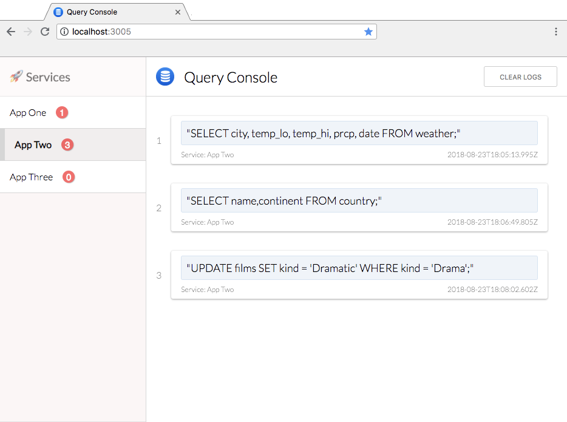

# query-console
A console for tracking and inspecting the queries being made by applications via tailing and parsing log files.



## Getting Started
+ Install query-console globally:
```bash
npm install -g query-console
```

+ Create a config JSON file specifying your query tracker information:
`service`: The name of the service being monitored.
`log_path`: The absolute path of the log file to tail and parse. (Note: Tilde path expansion is not supported)
`regexes`: The regular expression to use for determining whether or not a log line is a query.

```json
{
  "query_trackers": [
    {
      "service": "Application One",
      "log_path": "/Desktop/app-one/log/development.log",
      "regexes": [
        {
          "expression": ".*(select|create|update|delete|insert)\\b",
          "ignore_case": true
        }
      ]
    },
    {
      "service": "Application Two",
      "log_path": "/Desktop/app-two/log/development.log",
      "regexes": [
        {
          "expression": ".*(FROM|WHERE)\\b",
          "ignore_case": false
        }
      ]
    }
  ]
}
```

+ Then start query-console with:
```bash
query-console -c /Desktop/config.json
```
`-c` specifies the absolute path to the config file (Note: Tilde path expansion is not supported)

Now open up your browser to localhost:3005 to view Query Console :rocket:

You can also specify a different port using the `-p` flag.
`query-console -c /Desktop/config.json -p 3000`

_Note: This would start the Client Server on port 3000, and the API Server on the next port (i.e. 3001)_
